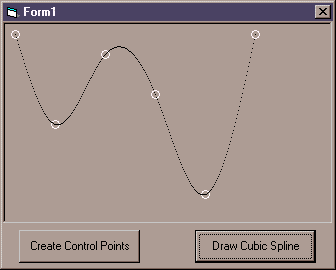



## Simple Cubic Spline Curve Plot

### Description

This is an App to show how to create a Cubic Spline curve to match control points.

I wanted to keep it mega simple and to the point, so the control points are hard coded.
 
### More Info
 

             |
---                |---
**Submitted On**   |2000-09-15 22:46:54
**By**             |[Jason Bullen](https://github.com/Planet-Source-Code/PSCIndex/blob/master/ByAuthor/jason-bullen.md)
**Level**          |Beginner
**User Rating**    |4.9 (34 globes from 7 users)
**Compatibility**  |VB 3\.0, VB 4\.0 \(16\-bit\), VB 4\.0 \(32\-bit\), VB 5\.0, VB 6\.0
**Category**       |[Graphics](https://github.com/Planet-Source-Code/PSCIndex/blob/master/ByCategory/graphics__1-46.md)
**World**          |[Visual Basic](https://github.com/Planet-Source-Code/PSCIndex/blob/master/ByWorld/visual-basic.md)
**Archive File**   |[CODE\_UPLOAD99049152000\.zip](https://github.com/Planet-Source-Code/jason-bullen-simple-cubic-spline-curve-plot__1-11488/archive/master.zip)

